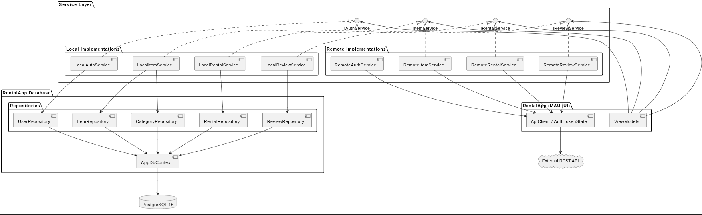
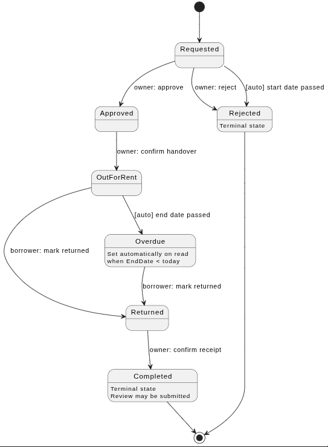
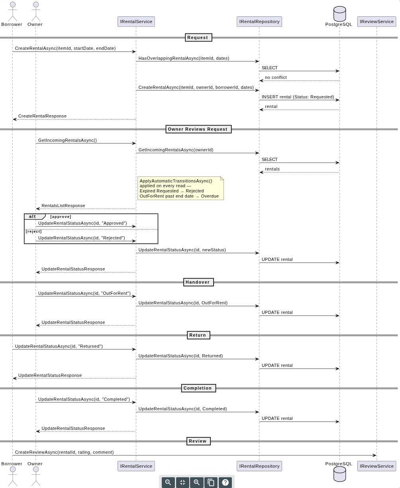
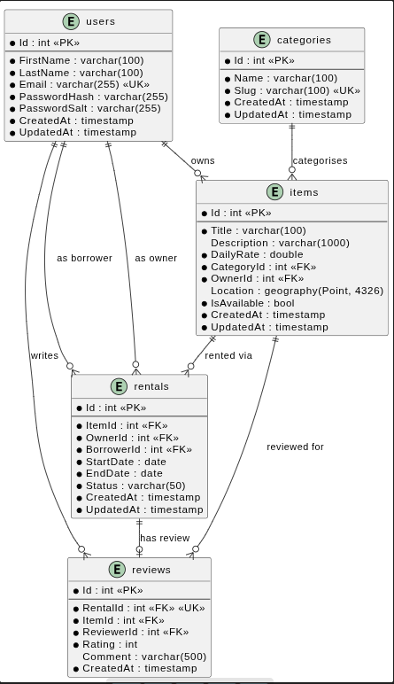

# Architecture

## Overview

RentalApp is a .NET MAUI Android application backed by PostgreSQL. The solution is split into four projects with clearly separated responsibilities: UI, data access, migrations, and tests.

| Project | Responsibility |
|---------|---------------|
| `RentalApp` | MAUI UI — Views, ViewModels, Services, Contracts, HTTP layer |
| `RentalApp.Database` | Data access — EF Core DbContext, Repositories, Rental state machine |
| `RentalApp.Migrations` | EF Core migration files and design-time factory |
| `RentalApp.Test` | Unit and integration tests |

---

## Component Architecture



The application is structured in four layers:

1. **ViewModels** — consume service interfaces via constructor injection; never reference repositories or `AppDbContext` directly
2. **Service interfaces** — `IAuthService`, `IItemService`, `IRentalService`, `IReviewService` — each with two symmetric implementations
3. **Repositories** — the only layer permitted to write EF Core queries
4. **AppDbContext / PostgreSQL** — the database, accessed exclusively through repositories

### Dual service implementations

Each service interface has a `Remote*` and a `Local*` implementation, registered via the DI container at startup:

| Implementation | Transport | Use case |
|---|---|---|
| `Remote*` | HTTP via `ApiClient` | Production and default debug |
| `Local*` | Repository-backed | Offline development via `make use-local-api` |

The active implementation is controlled by the `UseSharedApi` Android SharedPreference, written by `make use-remote-api` / `make use-local-api`. In release builds this is hardcoded to `true` at compile time — the local path is dead-code eliminated.

---

## RentalApp — MAUI UI

### MVVM Pattern

Views are XAML pages in `Views/`, bound to ViewModels in `ViewModels/`. All ViewModels extend `BaseViewModel`, which provides:

- `IsBusy` — observable busy flag set automatically by `RunAsync`
- `Title` — observable page title
- `SetError(msg)` / `ClearError()` — error state management
- `RunAsync(Func<Task>)` — wraps async operations with busy state, error clearing, and exception surfacing via `SetError`

All async ViewModel operations use `RunAsync` rather than manual try/catch blocks.

### ViewModel Hierarchy

```
BaseViewModel
└── AuthenticatedViewModel          (abstract — all post-auth ViewModels)
    ├── LogoutCommand
    ├── NavigateToProfileCommand
    ├── NavigateToAsync / NavigateBackAsync helpers
    │
    ├── ItemsSearchBaseViewModel<TItem>   (abstract — all item-listing pages)
    │   ├── Shared pagination state (IsLoading, CurrentPage, HasMorePages)
    │   ├── Category filtering
    │   ├── RunLoadAsync / RunLoadMoreAsync
    │   ├── ItemsListViewModel
    │   └── NearbyItemsViewModel
    │
    ├── ReviewsViewModel                  (abstract — all review-listing pages)
    │   ├── Reviews collection + AverageRating / TotalReviews
    │   ├── Paginated load state
    │   ├── RunLoadReviewsAsync / RunLoadMoreReviewsAsync
    │   └── ItemDetailsViewModel
    │
    ├── MainViewModel
    ├── RentalsViewModel
    ├── ManageRentalViewModel
    ├── CreateItemViewModel
    ├── CreateReviewViewModel
    └── UserProfileViewModel
```

`LoginViewModel` and `RegisterViewModel` extend `BaseViewModel` directly — they are pre-auth and registered as Singletons so form state survives navigation.

### Service Layer

Services are registered as Singletons. Infrastructure services are unconditional:

| Service | Interface | Notes |
|---------|-----------|-------|
| `INavigationService` | `NavigationService` | Shell wrapper; never call `Shell.Current` from ViewModels |
| `ILocationService` | `LocationService` | Wraps `IGeolocation` (device GPS) |
| `ICredentialStore` | `CredentialStore` | `SecureStorage`-backed credential persistence |
| `AuthTokenState` | — (concrete singleton) | Bearer token holder; shared by `LoginViewModel` and `AuthRefreshHandler` |

### HTTP Layer

`Http/` contains `IApiClient` / `ApiClient` — a typed `HttpClient` wrapper used by all `Remote*` services via `RemoteServiceBase`. `AuthTokenState` holds the active bearer token and is injected into `ApiClient` to attach `Authorization` headers.

### Contracts

Request and response records live in `Contracts/` under the `RentalApp.Contracts` namespace:

- `Contracts/Requests/` — `CreateRentalRequest`, `CreateItemRequest`, `CreateReviewRequest`, etc.
- `Contracts/Responses/` — `ItemDetailResponse`, `RentalDetailResponse`, `ReviewResponse`, etc.
- `IItemListable` — shared interface implemented by both `ItemSummary` and `ItemDetailResponse`, required by `ItemsSearchBaseViewModel<TItem>`

`RentalApp.Database` does not reference these types — they are consumed only by `RentalApp` and `RentalApp.Test`.

### Navigation

Shell routes are declared in `AppShell.xaml`. Root routes (`//login`, `//loading`, `//main`) are `ShellContent` items and replace the navigation stack when navigated to. All other routes are registered via `Routing.RegisterRoute`. Route name constants live in `Constants/Routes.cs`.

### DI Lifetimes

| Lifetime | Registrations |
|----------|--------------|
| Singleton | All services (`IAuthService`, `IItemService`, etc.), `AuthTokenState`, `ICredentialStore`, `INavigationService`, `ILocationService`, `LoginViewModel`, `RegisterViewModel` |
| Transient | All other ViewModels and Pages |

---

## RentalApp.Database — Data Access

### Repositories

Repositories are the exclusive location for EF Core queries. Services must not inject `AppDbContext` directly.

| Repository | Aggregate |
|-----------|-----------|
| `IUserRepository` | `User` |
| `IItemRepository` | `Item` |
| `ICategoryRepository` | `Category` |
| `IRentalRepository` | `Rental` |
| `IReviewRepository` | `Review` |

Each repository manages its own short-lived `AppDbContext` lifetime via `IDbContextFactory<AppDbContext>`. Repositories must not cross aggregate boundaries — cross-aggregate data assembly is the responsibility of the service layer.

### Rental State Machine



State transitions are enforced via a state-object pattern in `States/`. `RentalStateFactory.From(rental.Status)` returns the current state object; calling `.TransitionTo(targetStatus, rental)` either returns the new state or throws `InvalidOperationException`.

Role-based transition rules enforced by `LocalRentalService`:

| Status | Who can set it |
|--------|---------------|
| `Approved`, `Rejected` | Owner only |
| `OutForRent` | Owner only |
| `Completed` | Owner only |
| `Returned` | Borrower only |
| `Overdue` | Automatic — never a valid caller target |

Two transitions are applied automatically on every read by `ApplyAutomaticTransitionsAsync`:
- `OutForRent` → `Overdue` when `EndDate < today`
- `Requested` → `Rejected` when `StartDate < today`

---

## Rental Workflow



The full lifecycle from request to review:

1. **Borrower** submits a rental request — overlap check runs before insert
2. **Owner** views incoming rentals and approves or rejects
3. **Owner** confirms handover by transitioning to `OutForRent`
4. **Borrower** marks the item returned
5. **Owner** confirms receipt and transitions to `Completed`
6. **Borrower** may submit one review (enforced by unique index on `reviews.RentalId`)

---

## Database Schema



### Notes

- `rentals.Status` is a string-stored enum: `Requested` → `Approved`/`Rejected` → `OutForRent` → `Overdue`/`Returned` → `Completed`
- `items.Location` is a PostGIS `geography(Point, 4326)` column — `UseNetTopologySuite()` is configured on the EF options
- `reviews.RentalId` carries a unique database index — one review per rental maximum
- `rentals` holds two separate foreign keys to `users`: `OwnerId` (item owner) and `BorrowerId` (renter)
- Passwords are hashed with BCrypt; password salts are stored separately

---

## RentalApp.Migrations

A class library housing EF Core migration files. Implements `IDesignTimeDbContextFactory<AppDbContext>` so `dotnet ef` can target the project directly without a separate startup project.

```bash
dotnet ef migrations add <Name> --project RentalApp.Migrations
dotnet ef database update --project RentalApp.Migrations
```

---

## RentalApp.Test

Tests mirror the source structure under `ViewModels/`, `Services/`, `Http/`, and `Repositories/`. Integration tests use a real PostgreSQL database via `DatabaseFixture` — `AppDbContext` is never mocked.

To test abstract ViewModels, a `private sealed TestableViewModel` inner class exposes protected members. See `ItemsSearchBaseViewModelTests` for the established pattern.

---

## Infrastructure

| Concern | Detail |
|---------|--------|
| Database | PostgreSQL 16 — `app_user` / `app_password`, database `appdb`, port 5432 |
| Local stack | `docker-compose up` — orchestrates `db`, `migrate`, and `app` services |
| Dev container | `.devcontainer/devcontainer.json` — .NET 10 SDK, Android SDK (build-tools 36.0.0), JDK 21 |
| CI/CD | GitHub Actions — builds docs with DocFX and deploys to GitHub Pages on push to `main` |
